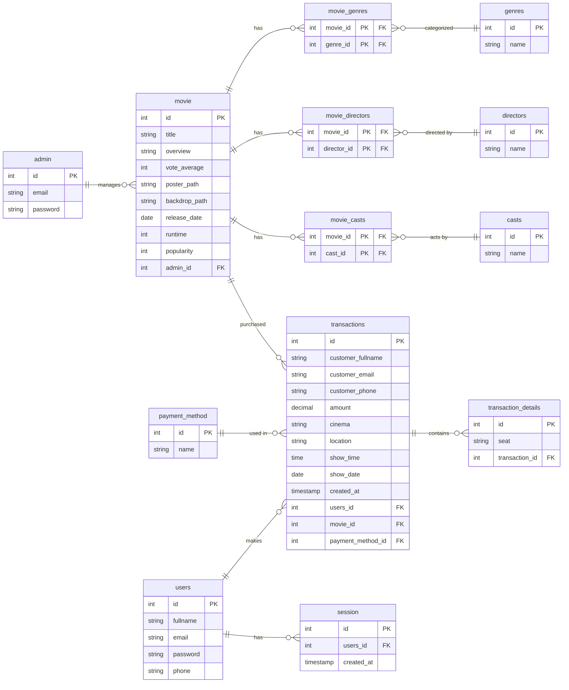

# Database & PostgreSQL Weekly Task

This project demonstrates how to create ERD with Database Schema using PostgreSQL for the latest weelytask / Cinevo application: Movie Ticket Booking App built with React JS

### ERD Cinevo: Movie Ticket Booking App

