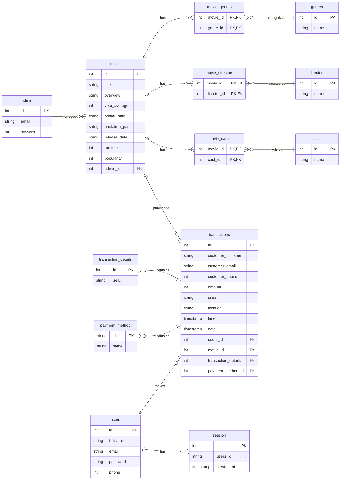

# Database & PostgreSQL Weekly Task

This project demonstrated how to create ERD with Schema Database with PostgreSQL for latest weelytask app / Cinevo: Movie Ticket Booking App built in with React JS

### ERD Cinevo: Movie Ticket Booking App

